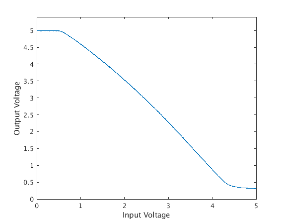

# Term Project - Music Box
For the term project I am creating a music box using the PIC microcontroller. 

## Requirements
- 3 Voices (2 Square, 1 Triangle)
    - Generated using Timer1, Timer2, and Timer 3
    - Individual Voice Volume control
- Play 2-8 Songs Selectable using PORTB Buttons
    - 4 Songs is the target
- Display the Current song playing on the LCD Display


# Design

## Main C Code

### Setup
The setup of the whole process includes setting the PortB to input and PortC to output, setting up all the interrupts, and setting up the LCD

Timer0 is setup as a low priority interrupt for the instruction processing and Timer1, Timer2, and Timer3 are setup as high priority interrupts for sound generation.

### Instruction Processing
For the instruction processing Timer0 is used. It will reset itself and then check if the current tick has an instruction if so, it will process it and check if there is another. If not it will increment the tick count. The instructions are stored as 6 bye words, the first 3 bytes are the tick on which the instruction occurs and the remanding 3 bytes are the instruction itself.

There are 8 possible instructions: `SET_TEMPO`, `SET_VOICE0_FREQUENCY`, `SET_VOICE1_FREQUENCY`, `SET_VOICE2_FREQUENCY`, `SET_VOICE0_VOLUME`, `SET_VOICE1_VOLUME`, `SET_VOICE2_VOLUME`, and `END`. The instruction code is stored in the last/upper byte of the 3 byte instruction. 
- For `SET_TEMPO`, `SET_VOICE1_FREQUENCY`, and `SET_VOICE2_FREQUENCY`, the prescale factor is extracted from the second half of the high byte, while the count is taken from the first two bytes of the instruction. The delay is also accounted for at this point.
- For `SET_VOICE0_FREQUENCY` the parameters are encoded in the first two bytes like so: `BBBB:BBBB xAAA:AxCC` where `A`, `B`, and `C` are the parameter of Timer2
- For `SET_VOICE#_VOLUME` it takes the second half of the high byte and the middle byte as the voice volume.
- For `END` it disables all interrupts and clears everything for the next song.

### Note Generation
For note generation it checks each of the Timers and resets them if needed, and if the timer is reset, the voice's high bit (`Voice#High`) is toggled. The voices are then combined by adding or subtracting based on the whether the `Voice#High` is set and then combined with half output to generate a signal centered at 2.5 volts. This is then sent to the Digital to analog converter to generate the sound.

### Song Selection
For the song selection the main loop is checking portB for if any of the buttons have been pressed, if so it also checks that it is not the one that is currently playing, if so it will start the song that corresponds to that button and displays its name on the LCD.

## Song Converter
In order to better facilitate putting songs on the PIC I created a tool to convert midi data into the format that I am using. I am using NodeJS and a library that parses a midi file. In order to convert the midi I take the first three tracks and use them as the 3 voices. I filter the events of interest, calculate the corresponding tick, and then add it to a list. I do this for the first 3 tracks and then I sort them by the tick. After they have been sorted I then convert the event to instructions creating a list of bytes describing the data. I do this for all the Songs that I want to include and then I package this all up into one file. The data is a `const` so it is sorted in program memory.

I also used several supporting scripts to easily compile and upload the project with ease.

## Hardware
To produce sound, I am using a Digital-to-Analog Converter (MCP4921) for variable volume control. I am then using a couple of resistors totaling 30k and a transistor (C6144) to amplify the output to the 8 ohm speaker. I did a series of tests in order to find the optimal resistor combination. From my tests, I found that 30k gave me this curve which I am satisfied with:



# Results
## Verification
Here is a video of the Test sequences I used to verify that the correct frequencies are played and to verify volume control:
<video controls>
    <source src="./Results/Test.mp4">
</video>

## Demonstration
Here are a few samples of demo songs, I've included both a camera recording, and a recording of the raw audio signal:

- Legend of Zelda Overworld Theme:
<video controls><source src="./Results/LegendOfZeldaOverworld.mp4"></video>
<audio controls><source src="./Results/LegendOfZeldaOverworld.mp3"></audio>

- Megalovania:
<video controls><source src="./Results/Megalovania.mp4"></video>
<audio controls><source src="./Results/Megalovania.mp3"></audio>

- Lavender Town:
<video controls><source src="./Results/LavenderTown.mp4"></video>
<audio controls><source src="./Results/LavenderTown.mp3"></audio>

- Pallet Town:
<video controls><source src="./Results/PalletTown.mp4"></video>
<audio controls><source src="./Results/PalletTown.mp3"></audio>

## Comments on the Development
In the end I am quite pleased with the results I had included a triangle voice in my requirements but that did not end up being implemented, I may come back to do that. When initially planning this project I had planed to use a series of resister and output four bits to create the volume control but I decided to switch to a DAC for more consistent results and so I would not have to fiddle with getting the resistors all connected. In the process of developing this I learned quite a bit about how the PIC processor works and some of the more nuanced things about memory access and pointers. I had at one point been examining the assembly code for optimization and curiosity.

## Ideas for modifications and improvements
Here are some ideas that I had for improvement or that I was not able to implement:
- Multi note support 
- Compress instruction data
    - Delta Time instead of absolute time (Similar to Midi Format)
    - Lookup table for note timer values
    - Less precision for volume
- Different Voices
    - Triangle
    - Sawtooth
    - Custom?

# Compiling Code
In order to compile this, the Microchip C Compiler (xc8) must be installed and NodeJS/npm must be installed.
To compile:
```bash
npm run install
npm run build
```
and then if desired, the automatic code uploader can be started by:
```bash
npm run startCodeUploader
```
else the [hex file](C_Code/main.hex) can be found under the C_Code folder
